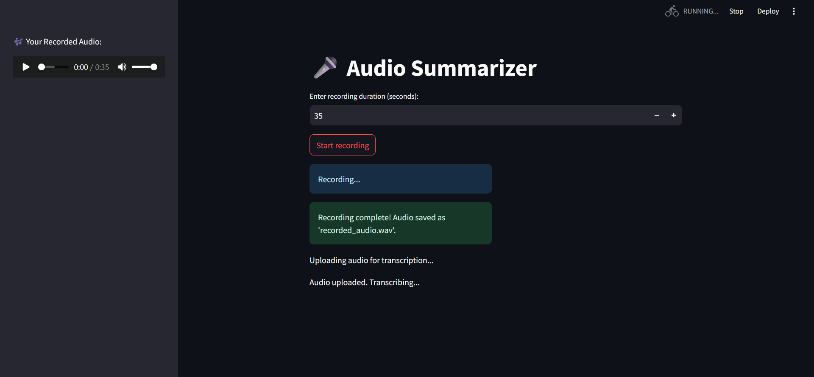

# Audio Summarizer and Recorder

This project is a simple **Audio Summarizer** and **Recorder** built using **Streamlit**, **Transformers** and **Assembly AI**. It allows users to record audio, transcribe it, analyze sentiment, and summarize the transcription in a few easy steps.The user can also listen to the recorded audio.


## Features
- **Audio Recording**: Record audio directly from your browser.
- **Audio Transcription**: Automatically transcribe audio to text using **Speech Recognition** or an external service.
- **Sentiment Analysis**: Analyze the sentiment of the transcribed text (Positive, Negative, or Neutral).
- **Summarization**: Summarize the transcribed text for a concise version of the content.



## Installation
Ensure you have Python installed, then install dependencies:
```bash
pip install -r requirements.txt
```
## Usage
Run the file locally:
```bash
streamlit run summary.py
```
